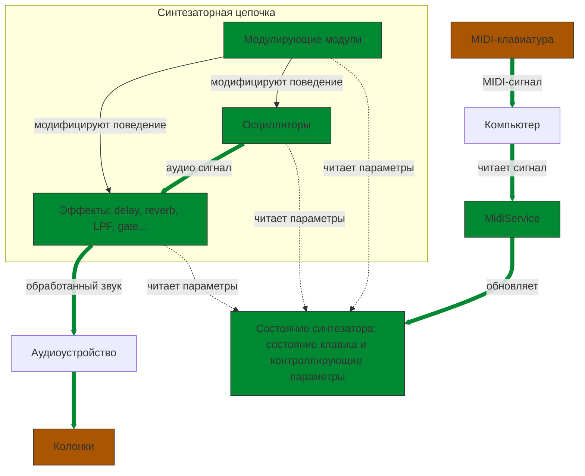

# delta-synth, синтезатор на Rust

Мы будем реализовывать синтезатор на языке программирования Rust.

## Что такое синтезатор?
Синтезатор -- любая программа (или устройство) которое умеет производить звуки. В нашем случае мы будем писать синтезатор основанный на _осциляторах_ -- устройств, которые умеют генерировать волны разных частот и разной формы -- синус, пила, квадратную и т.д. В дополнение к этому мы будем реализовывать другие аудиомодули, которые делают звук интереснее, такие как _gate_, _LPF (Low pass filter)_, _delay_ и прочие.

Для того чтобы управлять синтезатором, мы будем использовать MIDI сигналы -- стандартный способ сообщать аудиоустройству о том какие клавишы клавиатуры были нажаты, с какой силой.  

Вот как будет в общем выглядеть цепочка -- от нажатия клавишы до воспроизведения звука:

Мы будем использовать следующие библиотеки:
* `cpal` -- отвечает за работу со звуком. Общая логика такая: создаётся независимый поток, в него передаётся функция-обработчик, которая принимает текущий аудио поток и его модифицирует в соответствии с состоянием синтезатора.
* `midir` -- отвечает за работу с MIDI. Цель -- создать MIDI-service, который слушает MIDI-сообщения и обновляет состояние синтезатора в соответствии с ним.

## Технологии, которые мы часто будем использовать
Поскольку мы работаем в мультипоточном приложении, требуется использовать специальные типы.
1. `AtomicU32` -- мы будем его использовать для того чтобы хранить определённое значение в состоянии синтезатора. Этот тип хранит обычный `u32` (т.е. число от 0 до 255) и поддерживает ассинхронные чтение и запись. Применение:
  * `.store(value, order)` -- записывает `value`. `order` -- дополнительное конфигурирующее значение, обычно будет `Ordering::Relaxed`.
  * `.load(order)` -- читает значение.

2. `Arc<T>` -- этот тип обозначает _умный потокобезопасный указатель_ на структуру. Мы будем его использовать для структуры состояния синтезатора, потому что в нём хранятся только примитивные атомарные значения. Для более сложных структур нужно добавлять ещё один тип -- `Mutex`

3. `Arc<Mutex<...>>` -- это способ сделать _умный указатель_ на _мьютекс_ на тяжёлую структуру. Это некоторый классический способ работать с значениями которые нужно потокобезопастно обрабатывать. Типичный способ применять:
  * `Arc::new(Mutex::new(v))` -- упаковывает `v` в мьютекс и создаёт на него умный указатель.
  * `acr_mutex_v.lock().unwrap()` -- ненадёжный способ распоковать значение из `Arc<Mutex<...>>`.
    * `acr_mutex_v.lock()` возвращает `Result`, который может быть `Ok` или `Error` и по хорошему нужно анализировать паттерн-матчингом.

